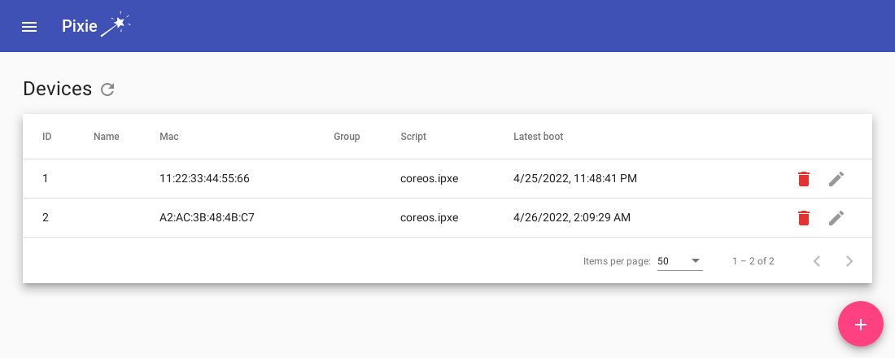
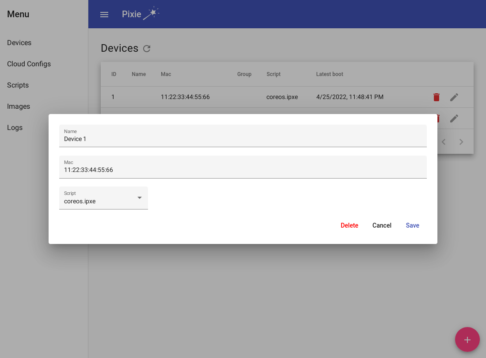
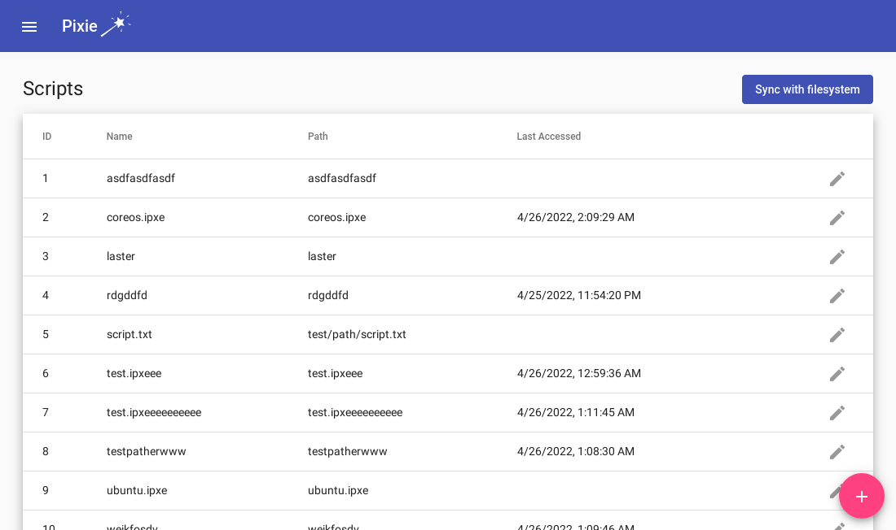

# Pixie

Pixie is a web interface for managing and auditing PXE booted clients. Boot scripts, images, and cloud config files can be easily assigned to different devices on the fly. Every boot and every configuration change can be inspected via an audit log.

When a device that isn't recognized by Pixie tries to network boot, it immediately appears in Pixie where it can be assigned a boot script. Until then, an iPXE shell prompt is started on the device (or the user-assigned default script is loaded). Once assigned, the device can simply be restarted to have it boot to the assigned script.

PROJECT IS IN ALPHA. MORE DOCUMENTATION AND FUNCTIONALITY TO COME... BUT IT WORKS! :)

The `main` branch is considered stable (or as stable as possible for alpha sofware).

Please feel free to open an issue or pull request!

## Features
- [x] TFTP server (no docker support yet)
- [x] Web interface & HTTP API
- [x] Chainload iPXE boot image generator
- [x] Upload/manage scripts and boot images
- [x] Add scripts, cloud configs, and images in bulk directly from the filesystem
- [x] Devices which try to network boot are added to the database
- [x] Assign a default boot script
- [x] Assign scripts to devices
- [x] Logging (audit trail)
- [x] Upload/manage config files (ignition, cloud-init, etc)
- [ ] Config file (ignition, cloud-init, etc) handlebars templating
- [ ] Build a boot script (select images, config) with a GUI
- [ ] Authentication (RBAC?)
- [ ] Groups (assign a script/config to a group of devices)
- [ ] Boot script handlebars templating
- [ ] Library of boots (ex: ubuntu, debian, coreos, etc) that can be "imported" and modified
- [ ] Temporarily boot another script for testing/debugging (for x number of boots, or y seconds, etc)
- [ ] Disable TFTP server? (use your own)

## Screenshots





## Getting started
Pixie works by creating a static initial boot image for all PXE booted clients. This `pixie.kpxe` file [chainloads](https://ipxe.org/howto/chainloading) the script located at `<PIXIEHOST>/boot.ipxe?mac=<MACADDRESS>`, which resolves to the appropriate boot script for the device with the provided MAC address.

For example, the call may look like: `http://pixiehost:8880/boot.ipxe?mac=112233445566`, which would load the script that Pixie has associated to the device with MAC address `112233445566`.

Generating the `pixie.kpxe` file requires building iPXE, which requires a fair amount of dependencies. A docker image is defined here for convenience:
```bash
# Build the docker image used to generate the kpxe file
docker build -f Dockerfile.generate-kpxe -t pixie-kpxe-generator .
```

The generated file will be placed inside the container at `/output/pixie.kpxe`, and it needs to be placed in the TFTP root directory using volume mounts.

As an example, if using the default configuration, `Paths.FileServer` (the TFTP root) is `data/files`:
```bash
# Create the local directory that the generated file will be copied into
mkdir -p data/files
# Change the pixiehost address below to a host that will resolve to Pixie!
docker run -it -v "$(pwd)/data/files:/output" pixie-kpxe-generator 'http://pixiehost:8880'
```

Then, run the app!

## Run using docker
This is the recommended method:
```bash
docker-compose up -d
```

Then navigate to `localhost:8880` in a browser.

>NOTE: The image can be rebuilt/updated with `docker-compose build`

## Run locally
To run the app without docker, first build the components:
```bash
# Build the web interface
(cd web/ && ng build)
# Build the app
(cd src/ && go build -o ../pixie)
```

Then run the app:
```bash
# TFTP server (running on a privileged port) is included
# Therefore sudo must be used.
sudo ./pixie
```

Then navigate to `localhost:8880` in a browser.

## Configuration

**The default configuration should be sufficient for most users.**

To show configuration options and their explanations, see the [default config](src/config/default.yaml)

To tweak the config, use the default as a template:
```bash
# By default, the user config file is loaded from `data/pixie.yaml`
cp src/config/default.yaml data/pixie.yaml
```

Then edit `data/pixie.yaml` as needed.

Or, load a different config file:
```bash
./pixie --config-file /path/to/config
```
